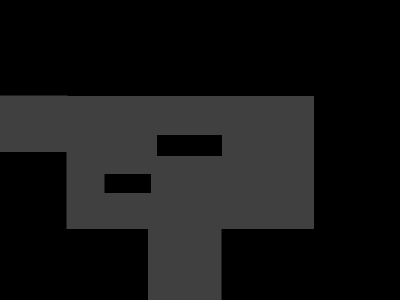
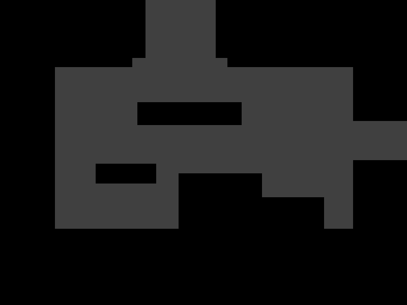
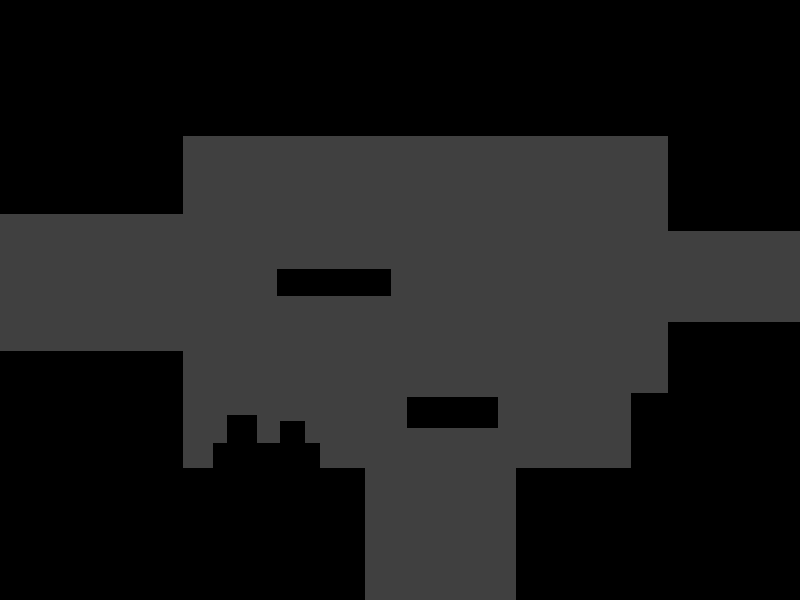
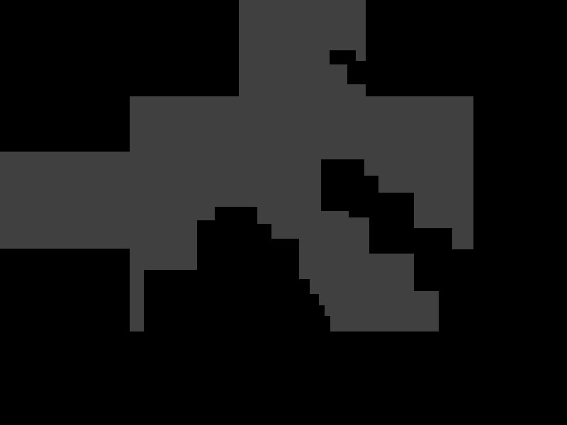
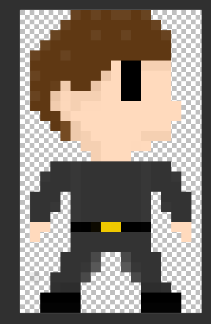

# **Startdocument C#2**

Cody Vos, Tom Olijve, Lars Kuizenga, Yanniek Wielage

# Het Idee

Het idee is om een 2d game te maken waarin de speler zich verplaatst door een procedureel gegenereerde level. Een procedureel gegeneerd level is een level waarin de computer het level heeft gecreëerd. Hierdoor kan een level willekeurig worden ingedeeld, en kan elk level verschillend zijn. Hierin is het doel om steeds verder te komen, doormiddel van upgrades en nieuwe wapens te vinden. Dit heeft veel af van een roguelike. Een roguelike is een gamegenre waarin door verschillende kleine levels wordt gemanoeuvreerd. Dit werkt goed als het procedureel gegenereerd is, want dan ik elk level verschillend. 

Om het procedurele genereren een werkelijkheid te maken, zullen er delen van een basislevel worden gemaakt. Deze delen worden gemaakt zodat zij op alle andere delen passen, je kunt hierbij denken aan het in elkaar leggen van een puzzel waarbij elk deel een opening heeft waardoor niet alles op elkaar past. De computer zal hier willekeurig voor elk deel van het scherm een deel uitkiezen. Hierdoor is elk level anders.

Echter de gevechtsstijl die hierin word gebruikt is meer als een Smashlike, denk bijvoorbeeld aan brawlhalla of aan super smash bros. Het essentiële van deze gevechtsstijl is dat de aanval bepaald wordt door de richting welke wordt aangegeven door de gebruiker. Als die richting rechts is, zal er bijvoorbeeld een zware aanval kunnen worden gebruikt. Door deze gevechtsstijl te implementeren zal het doorlopen van de verschillende levens een stuk interactiever worden, en kan elke level op een andere manier worden aangepakt. 

## **Development Framework** 

Om het idee tot leven te brengen, zal er gebruik worden gemaakt van een development framework. Een development framework is essentieel tot het creëren van het idee.

Voor dit project zal er gebruik worden gemaakt van Monogame. Monogame is een .NET library bedoeld voor het creëren van games op desktop, consoles of mobile. Monogame heeft de optie om 2D games te ontwikkelen, wat belangrijk is voor dit project. Dit komt doordat de hele game zal worden ontwikkeld in 2D. Monogame maaakt gebruik van C#, en het hele project word dus ontwikkeld binnen deze programmeertaal.

Een voorbeeld van een hulpmiddel welke Monogame de gebruiker biedt is de Game class. Deze geeft toegang tot de functies: 

- Load/Unload content
- Update
- Draw
- etc.

Dit is een goede basis waar verder op kan worden gebouwd voor ons project.

## **Features en Prioriteiten**

In dit hoofdstuk staat welke features vereist zijn om af te hebben, en welke features extra zijn. Ook zullen er prioriteiten worden gesteld, welke aan bod komen bij tijdsnood. De features staan in prioriteitsvolgorde. 

**Vereiste features**

1. Basis van het procedureel genereren van de levels.
2. Bewegen door de levels
3. Een basis gevechtssysteem, waarbij beide de tegenstander zowel als de speler schade kan nemen
4. 1 basis tegenstander bestuurd door de computer in elk level

**Extra features**

5. Een uitgebreid gevechtsysteem, met een andere aanval afhankelijk van de positie waarin de speler zich bevindt.
6. Een grotere variatie van levels.
7. Een grotere variatie van tegenstanders.

## **Planning**

De planning is te vinden in het bijgevoegde Excel bestand.

## **Literatuur**

De volgende literatuur en documentatie zal worden gebruikt om dit project te realiseren: 

- https://docs.monogame.net/
  - Als documentatie voor Monogame
- https://docs.microsoft.com/en-us/dotnet/csharp/
  - Als documentatie voor C#
- https://docs.microsoft.com/en-us/dotnet/
  - Als documentatie voor .NET

## **Visualisatie**

Dit zijn de eerste visualisaties, welke een eerste idee geven van hoe de game eruit gaat zien. 

Ingang standaard level:

Voorbeelden gegenereerde levels: 

Sprite karakter:

