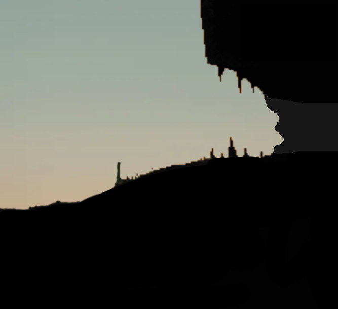
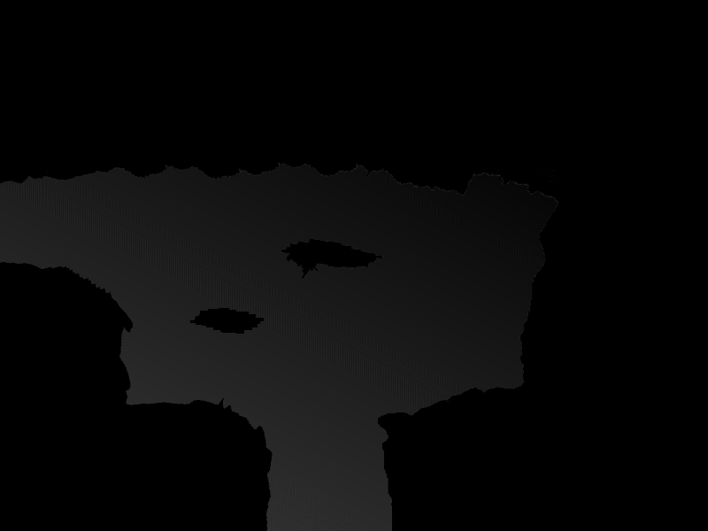
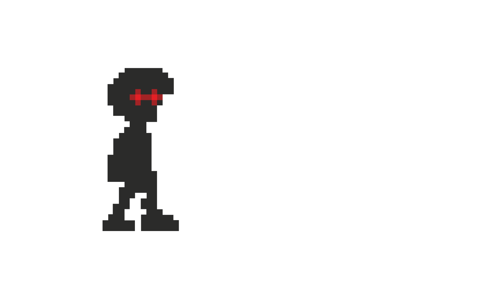

# **Startdocument C#2**

Cody Vos, Tom Olijve, Lars Kuizenga, Yanniek Wielage

# Het Idee

Ons idee is het maken van een 2D platformer game waarin je speelt als een schaduw karakter dat vecht tegen karakters van het licht. De levels worden semi-automatisch gegenereerd. Er bestaat een achttal levelcomponenten met ieder ten minste één opening. Deze componenten passen als puzzelstukjes op elkaar waardoor er een pad door alle componenten van het begin tot het einde ontstaat.

Het doel is om steeds verder te komen, door upgrades te vinden. De dood is permanent wat betekend dat het spel opnieuw begint wanneer je sterft. Samen met het de semi-automatisch gegenereerde levels wordt dit vaak als een roquelike gezien.

Echter de gevechtsstijl die hierin word gebruikt is meer als een Smashlike, denk bijvoorbeeld aan brawlhalla of aan super smash bros. Het essentiële van deze gevechtsstijl is dat de aanval bepaald wordt door de richting welke wordt aangegeven door de gebruiker. Door deze gevechtsstijl te implementeren zal het doorlopen van de verschillende levens een stuk interactiever worden, en kan elke level op een andere manier worden aangepakt.

## **Development Framework** 

Om het idee tot leven te brengen, zal er gebruik worden gemaakt van een development framework. Een development framework is een geheel van componenten dat gebruikt kan worden bij het programmeren van applicaties.

Voor dit project zal er gebruik worden gemaakt van Monogame. Monogame is een .NET library bedoeld voor het creëren van games op desktop, consoles of mobile. Monogame heeft de optie om 2D games te ontwikkelen, wat belangrijk is voor dit project. Dit komt doordat de hele game zal worden ontwikkeld in 2D. Monogame maakt gebruik van C#, en het hele project word dus ontwikkeld binnen deze programmeertaal.

Een voorbeeld van een component welke Monogame de gebruiker biedt is de Game class. Deze geeft toegang tot de functies: 

- Load/Unload content
- Update
- Draw
- etc.

Dit is een goede basis waar verder op kan worden gebouwd voor ons project.

## **Features en Prioriteiten**

In dit hoofdstuk staat welke features vereist zijn om af te hebben, en welke features extra zijn. Ook zullen er prioriteiten worden gesteld, welke aan bod komen bij tijdsnood. De features staan in prioriteitsvolgorde. 

**Vereiste features**

1. Het semi-automatisch genereren van levels op basis van acht bestaande levelcomponenten.
2. Bewegen door de levels.
3. Een gevechtssysteem, waarbij zowel de tegenstander als de speler schade kan nemen en dood kan gaan.
4. Eén soort tegenstander bestuurd door de computer in elk level.

**Extra features**

5. Een uitgebreid gevechtssysteem, met een andere aanval afhankelijk van de positie waarin de speler zich bevindt.
6. Meer dan acht levelcomponenten.
7. Meer dan één soort tegenstander.

## **Planning**

De planning is te vinden in het bijgevoegde Excel bestand.

## **Literatuur**

De volgende literatuur en documentatie zal worden gebruikt om dit project te realiseren: 

*MonoGame Documentation*. (z.d.). MonoGame. Geraadpleegd op 10 juni 2021, van 
	https://docs.monogame.net/

B. (z.d.). *C# docs - get started, tutorials, reference.* Microsoft Docs. Geraadpleegd op 10 juni 2021, van 
	https://docs.microsoft.com/en-us/dotnet/csharp/

B. (z.d.-c). .*NET documentation*. Microsoft Docs. Geraadpleegd op 10 juni 2021, van 
	https://docs.microsoft.com/en-us/dotnet/

## **Visualisatie**

Dit zijn de eerste visualisaties, welke een eerste idee geven van hoe de game eruit gaat zien. 

### Ingang standaard level:

### Voorbeelden gegenereerde levels:
Level component 1

Level component 1 met karakter

Level component 1 hitboxes

### Sprite karakter en enemy:

Het speler karakter

Het vijand karakter

Het speler karakter lopend

